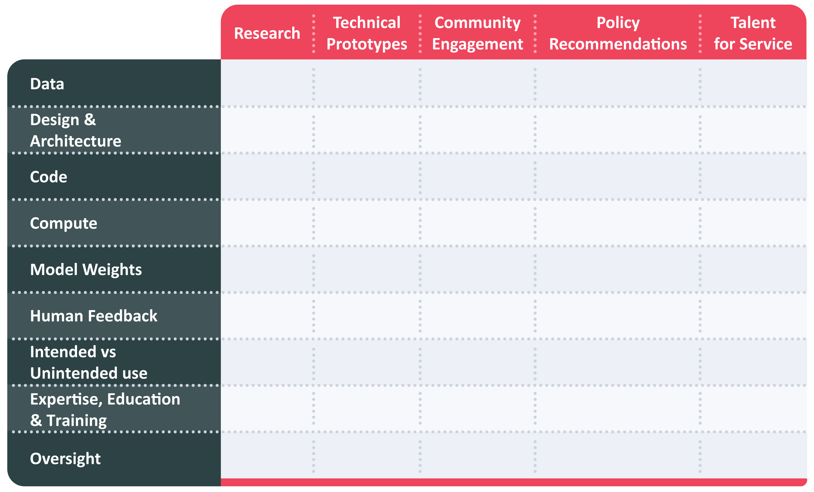
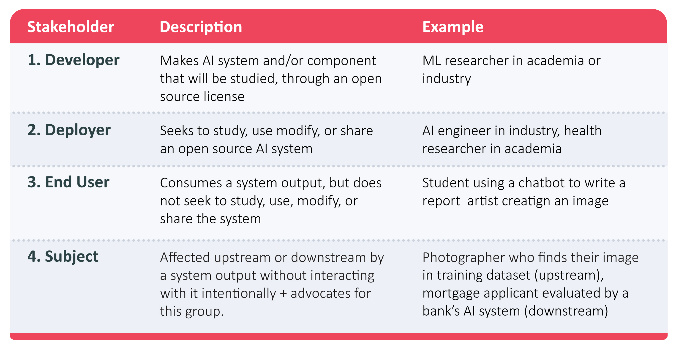

# Vision and Mission

The Open Forum for AI ([OFAI](https://www.cmu.edu/engin/programs/ofai.html)) is a university-led, collaborative initiative that aims to bend the arc toward human-centered, responsible, transparent and ethical AI. While AI offers tremendous potential to improve lives and society, there are noteworthy concerns, both realized and potential, that must be addressed to ensure that everyone benefits from the use of AI and that its development accounts for the interests and well-being of all stakeholders and impacted communities. 

OFAI aims to achieve its goal by raising the voices of the academic and non-profit sectors to balance out the triple helix that includes industry and government. Led by Carnegie Mellon University ([CMU](https://www.cmu.edu/)), OFAI includes the open source program offices from [George Washington University](https://ospo.gwu.edu/), [Georgia Institute of Technology](https://ospo.cc.gatech.edu/), and [University of Texas at Austin](https://opensource.utexas.edu/). The triple helix of universities, government, and industry successfully researched, designed, and implemented the Internet and web. Arguably, the balance has tilted toward industry with the deployment of AI (building on decades of university based research and government investments). OFAI aims to amplify universities’ ability to act as a “voice of reason” in the AI landscape, which is currently impacted by various economic and political incentives.

While universities represent an important sector for the development and oversight of AI, OFAI recognizes the role of other perspectives and expertise to ensure a holistic strategy and approach. OFAI incorporates the important role of philanthropy with support from Omidyar Network and NobleReach Foundation and legal and policy expertise from the [Open Source Initiative](https://opensource.org/) (OSI) and [Atlantic Council](https://www.atlanticcouncil.org/). Rounding out OFAI are individual fellows from the private and government sectors including [BGV](https://benhamouglobalventures.com/) capital, [Cerebras](https://cerebras.ai/), [GitHub](https://github.com/), [Microsoft](https://www.microsoft.com/), and the US Navy who act as sounding boards and connectors. OFAI’s most recent partners are [Creative Commons](https://creativecommons.org/) and [Conscience](https://conscience.ca/). Both organizations offer expertise and capacity related to public and/or open datasets and community engagement. In addition, Creative Commons offers expertise in the fields of copyright and content licensing, and Conscience offers expertise in benchmarking and challenges.

OFAI recognizes that other organizations and individuals can augment existing capacity and address gaps in our ability to evaluate AI model components and lifecycle stages. OFAI has initiated dialogue with potential new organizational members and individuals who can form an Advisory Board. OFAI aims to act as a lighthouse in the rapidly evolving AI landscape, a collection of thought leaders and a coordinated means for strategic, collective action. But at the heart of OFAI is its embrace of human-centeredness in the sense that diverse human perspectives must be incorporated at every stage of the AI lifecycle and for every component of AI systems. Ultimately, those who use AI systems must affirm those systems’ transparency, safety, unbiasedness, and adherence to responsibility and ethics.

In addition to the importance of the aforementioned triad in the development of the internet and the web, openness as a design principle played a critical role in fostering innovation, participation, and adoption. TCP/IP and HTTP are examples of open protocols that fostered the transformative effects of the internet and web and arguably mitigated localized or fragmented approaches. OFAI aims to foster similar outcomes and benefits with AI by building upon version 1.0 of the  Open Source AI Definition (OSAID). Mozilla has endorsed the OSAID, while noting it marks a “critical juncture in the evolution of the internet” and “it’s about shaping the future of the technology and its impact on society.”

Openness represents a key characteristic of OFAI in three important respects. First, OFAI believes that openness in AI will yield societal benefits in a manner similar to open data, open source software and open hardware. For example, of all code bases, 96% use OSS[^1]. A recent Harvard Business School study[^2] concluded that OSS has generated $8.8 trillion of value and reduced production costs by a factor of 3.5x. Openness in AI is poised to deliver similar benefits for a wide range of society as both developers and consumers of AI, particularly as it relates to being proactive in design and implementation, rather than reactive as new AI systems are released.

Second, OFAI embraces being open in terms of testing current assumptions and assertions about AI. Given the speed at which interest in AI has accelerated since the release of ChatGPT 3.5, there is abundant speculation about AI. However, much of it is without evidence or affirming research. OFAI believes it is important to be open in terms of testing this speculation with foundational research testing hypotheses, even including the possible benefits of openness in AI (e.g., as compared to potential risks). Recent reports from the National Telecommunications and Information Administration[^3], Center for Strategic & International Studies[^4], and the Federal Trade Commission[^5], and [Kapoor et al. 2024](https://arxiv.org/pdf/2403.07918v1) [@kapoor_societal_2024] are relevant in this regard.

To this end, OFAI will develop an openness in AI framework that builds upon existing efforts such as the community process led by OSI toward the OSAID. This framework will also build upon existing efforts related to transparency by assessing the ability to evaluate AI systems (e.g., safety) and craft corresponding policy recommendations. 

Finally, OFAI recognizes that while foundational research should play an important role, the speed of AI necessitates a faster pace for its outputs and deliverables. For example, research agendas and outcomes will be shared via preprints, reflecting the value of open access in addition to the earlier forms of openness (e.g., data, software). Open science has demonstrated great value in accelerating the translation of research. 

OFAI encompasses five themes or working groups, which are intentionally interconnected: research, technical prototypes, community engagement, policy recommendations, and talent for service. Through coordinated collective action related to each of these themes, OFAI will translate university-based research into tangible, actionable outputs. 

# Research

Recent calls for openness in AI have intensified as concerns grow over the societal implications and potential risks of advanced technologies (see, e.g., [Shrestha et al. 2023](https://www.nature.com/articles/s43588-023-00540-0.pdf) [@shrestha_building_2023], [Merilehto 2024](https://osf.io/preprints/socarxiv/jnmzg) [@merilehto_generative_2024]). Advocates emphasize the importance of openness and transparency, urging organizations developing and using AI to disclose important information about their *models*, *data sources*, and *evaluations*, and providing *access* to foster accountability and public trust, and promote wide-ranging societal benefits, including scientific innovation and economic progress. As an example, the European Union's AI Act requires the disclosure of certain information (e.g., technical documentation, conformity assessments, and incident reporting) about high-risk AI systems. The U.S. AI Foundation Model Transparency Act similarly recognizes the importance of publicly disclosing information about high-impact AI systems. AI companies have also emphasized the need for collaborative efforts and knowledge sharing, to promote a safer, more responsible and inclusive approach to AI, and to foster innovations that prioritize societal benefits over proprietary interests.

**Open Source AI:** Building on the success of open-source software in the digital economy, open-source AI models could provide similar economic benefits. Given the high costs of foundation model development, there is a tendency for a few private actors to dominate the AI market ([Vipa and Korinek, 2023](https://www.brookings.edu/wp-content/uploads/2023/09/Market-concentration-implications-of-foundation-models-FINAL-1.pdf) [@vipra_market_2023]). Open source AI models provide a meaningful alternative to proprietary models. Open source AI models may enable greater participation, allowing open-source communities and users to orchestrate model development  ([Suresh et al., 2024](https://facctconference.org/static/papers24/facct24-107.pdf%20) [@suresh_participation_2024]) and add support tailored to unique needs. 

In addition to everyday users, researchers can cheaply finetune open access models, accelerating innovation and experimentation that is challenging with closed models. Broader societal benefits can also emerge from a collaborative, open AI ecosystem. As one example, sharing model weights that are energy-intensive to create can reduce industry-wide energy consumption and contribute to sustainability targets ([Keller et al., 2024](https://www.brookings.edu/articles/the-us-must-balance-climate-justice-challenges-in-the-era-of-artificial-intelligence/) [@keller_us_2024]). 

However, despite the promises of openness, many models marketed as “open-source” do not adhere to the freedoms identified within the open source software community, limiting their potential to distribute benefits widely. Prior work has proposed a ranked classification system to evaluate AI systems according to the level of openness they conform with ([Andrada et al. 2023](https://link.springer.com/content/pdf/10.1007/s00146-021-01326-6.pdf) [@andrada_varieties_2023], [White et al. 2024](https://arxiv.org/pdf/2403.13784v3) [@white_model_2024], [Gibney 2024](https://www.nature.com/articles/d41586-024-02012-5) [@gibney_not_2024], [Eiras et al. 2024](https://arxiv.org/pdf/2404.17047) [@eiras_near_2024], [Basdevant et al. 2024](https://arxiv.org/pdf/2405.15802) [@basdevant_towards_2024]), e.g., classifying them under open *science*, open *source*, open *data*, and open *access*. According to [OSI’s recently published definition](https://opensource.org/deepdive/drafts/open-source-ai-definition-draft-v-0-0-9) of *Open Source AI*, *“Open Source AI is an AI system made available under terms that grant the freedoms to:*

- ***Use** the system for any purpose and without having to ask for permission.*  
- ***Study** how the system works and inspect its components.*  
- ***Modify** the system for any purpose, including to change its output.*  
- ***Share** the system for others to use with or without modifications, for any purpose.”*

## Conceptualizing Openness for AI

Our conceptualization of openness expands these views beyond *open source,* and toward *open governance[^6]* of AI, with the overarching goals of improving transparency, reproducibility, accessibility, inclusivity and participation, collaboration, and accountability among a wide set of AI stakeholder groups, including technology developers, users and consumers, academia and research entities, non-profit and the civil society. We posit that appropriate forms of openness have to be determined with respect to the specific context and potential use cases. In particular, conceptualizing the appropriate form and level of openness requires clear responses to the following “6 W’s of Openness” questions:

- **Why?** What is the *purpose* of openness? Oftentimes, calls for openness cite mitigation of *risks* such as safety, privacy, equity, threats to democratic values (concentration of power, misinformation and disinformation), and even catastrophic risks as the key motivation. Openness can additionally foster positive goals such as innovation, economic competitiveness, and inclusion, accountability, reproducibility, agency and control, trust and adoption, usability and frictionless reuse, and collaborative improvement.  
- **What** are the proposed mechanisms for openness? For example, openness could be provided through technical forms of model explainability, transparency through documentation, ensuring reproducibility and auditability, making models open-source, and promoting wider participation in the design and evaluation of the technology. The specific mechanism for openness must be chosen to serve the purpose specified earlier.  
- **Who** are the entities that should provide openness? How are they incentivized to be open about their practices? What are the risks and benefits associated with the proposed form of openness for those entities?  
- **Whom** is the openness meant to serve? Openness may be aimed at serving the interests of academic researchers and educators, users and consumers of the technology, industry players, policy-makers, governments, non-profits, or civil society, more broadly. What are the risks and benefits associated with the proposed form of openness for each of these stakeholder groups?  
- **When** (or at what stage of the AI lifecycle) should openness mechanisms be implemented? What is the appropriate timing and frequency (e.g., before development, prior or post-deployment, or through periodic monitoring post-market)?  
- **Where** do the relevant stakeholders find the openness artifacts, documentations, and reports in a way that’s accessible and useful to them? How easy is it to discover and understand the information contained in those artifacts?

## Operationalizing Openness for AI

OFAI’s research arm aims to provide scientific evidence regarding the risks and benefits of various forms and degrees of openness, to inform policymakers and empower researchers, practitioners, and consumers of AI. 

### Year 1 Research Agenda

In Year 1, we will initiate our research effort across three dimensions of (1) understanding the current landscape, (2) designing stakeholder-oriented processes to evaluate openness, and (3) assessing the long-term impact of openness policies.

1. **Mapping the \`openness’ landscape in research, policy, and practice:**   
   Through a systematic review of the emerging research literature on AI openness, existing policy guidance and regulatory proposals, and industry-produced openness artifacts, we will characterize the current state of affairs and identify key gaps and challenges in the practice of AI openness. In particular, we will review recent policies that touch on AI openness, including the EU AI Act, the US Presidential Executive Order on AI, and other state-level bills and initiatives (see [Bommasani et al. 2024](https://arxiv.org/pdf/2402.16268v1) [@bommasani_foundation_2024] and [Liesenfeld et al. 2024](https://dl.acm.org/doi/pdf/10.1145/3630106.3659005) [@liesenfeld_rethinking_2024] for prior analyses), comparatively analyze the organizational policies and claims set forth by AI companies (e.g., in technical documentations of major frontier models or through press releases) regarding various forms of openness ([Solaiman 2023](https://arxiv.org/abs/2302.04844), [Eiras et al. 2024](https://arxiv.org/pdf/2405.08597) [@eiras_risks_2024]), and contrast them with our proposed conceptual framework of AI openness framework, e.g., by evaluating existing approaches across dimensions such as *accessibility* and *benefit* to the target audience and *fitness-for-purpose*.    
2. **Co-designing a structured process to choose the appropriate form and mechanism of openness through risk-benefit analysis.** In collaboration with AI developers and target stakeholder groups, we will then co-design usable *cost-benefit analysis guidelines* (see [Kapoor et al. 2024](https://arxiv.org/pdf/2403.07918v1) [@kapoor_societal_2024] for a representative framework) to determine the appropriate form and mechanism of openness considering contextual factors, including various forms of risks and benefits to key stakeholder groups under reasonably foreseeable usage conditions. This framework can guide policymakers in decision-making about openness and inform topics like licensing for open source AI.  
3. **Evaluating the long-term strategic implications of openness policies:** We will build an economic model to analyze the strategic interactions and long-term implications of adopting an open source AI definition on AI market outcomes. The goal of this theoretical model aim is to provide an initial understanding of whether and how different players would comply with open source requirements, and understand the downstream effects of policy requirements for openness on industry and the market more broadly. In particular, we will analyze the implications of openness for innovation (as captured by the *capabilities* of the general-purpose AI models and the extent of its *adoption* in domain-specific applications.) This analysis will inform policy maker’s choice of openness parameters in policy proposals aiming to foster innovation and economic growth through AI. 

### Year 2 Research Agenda

In Year 2 our efforts will concentrate on evaluating openness mechanisms in practice and through empirical methods. Through a number of case studies, we will critically assess whether the chosen mechanisms of openness serve the purpose of the target stakeholder groups. For example, focusing on one key stakeholder group (e.g., governments at the international, national, state, or local levels) we will investigate their needs and challenges they face regarding open-source AI. For example, our prior work has shown that additional openness around evaluations is urgently needed to improve government procurement and use of AI. Understanding the challenges and needs of government entities in procuring and using AI can inform their actions and policies as rule-makers, funders, and convener of open-source AI efforts. 

For the broader landscape, OFAI will organize its work along the dimensions of AI model components and its five, interrelated working groups of research, technical prototypes, community engagement, policy recommendations, and talent for service. This [OFAI Landscape Map](https://openforumai.github.io/landscape/) depicts the current and proposed areas of OFAI activity, providing a mechanism for identifying future partners who could either reinforce existing work or lead new areas of activity. It also respects the existing resources such as Stanford’s Foundation Model Transparency Index, Hugging Face’s model cards, and Partnerships in AI’s Guidance for Safe Foundation Model Deployment. The OFAI Landscape is a prototype based on the CNCF interactive landscapes generator. We welcome additions from OFAI members, partner organizations and those partaking in new and existing, complementary activities.

  
# Technical Prototypes

OFAI will develop and share a set of technical prototypes, which will address a wide range of use cases from a diverse community of contributors and users. These technical prototypes will adhere to the Open Source AI Definition. OFAI views these accessible technical prototypes as a key pathway for engagement with communities with diverse sets of lived experiences.

## Dietrich Analysis Research Education (DARE) Ecosystem

Carnegie Mellon University has developed the DARE ecosystem, currently in prototype phase. The DARE Ecosystem is being developed as an open-source AI project, aiming to become a comprehensive, adaptable AI system for academic support. Created by the Dietrich College of Humanities and Social Sciences Computing and Operations, it integrates various data sources and currently leverages commercial Large Language Models (LLMs), with plans to also incorporate smaller, open-source LLM models as cost and availability improve. At its core, DARE functions as a unified API server that standardizes API calls, tracks token costs, collects data for interaction studies, and links to data dashboards for decision making and research on AI interventions. 

The individual components of DARE are designed to act as digital AI lego blocks, which can be leveraged to solve different problems. This modular approach allows for flexible combinations of tools to address diverse academic and research challenges, enhancing the system's versatility and applicability across various domains.

DARE offers a practical solution for enhancing analytical capabilities and operational efficiency within educational institutions. It allows Dietrich College to centrally leverage existing and emerging LLM capabilities, providing more equitable, safer, and better-controlled LLM access. The system can use any LLM and available open statistical packages to perform analyses using natural language commands, significantly augmenting the analytic capability of Dietrich faculty and research staff while decreasing turnaround times.

The primary goal of DARE is to reduce technological and logistical barriers for access. Current support exists for researchers and students, with plans to extend support to staff. DARE teaching tools have been used by faculty at CMU to support research and have also been used by hundreds of students in the classroom. DARE use cases go beyond the CMU campus. 

DARE research support tools will be used at Brown University to support a Black Digital Humanities project for highlighting data from underrepresented communities for use in research and education, fostering a more inclusive approach to AI-driven academic support. It will also be leveraged by a Transatlantic research consortium for the study of human \+ AI interaction in the coming year. 

Once sufficiently developed, DARE and its component tools will be released as open-source AI, further democratizing access to advanced AI capabilities in academic settings. This commitment to openness and collaboration aligns with OFAI’s broader mission of reducing barriers and promoting equitable access to cutting-edge AI educational technologies.

# Community Engagement

Consistent with our goal of human-centered AI, OFAI will engage an inclusive community of stakeholders to inform, contribute, and validate the Forum's body of work. Establishing visibility and accessibility of working group outputs, even while in process, will be a priority. This process will include consistent publication of news, project progress and successes, opportunities to provide subject matter expertise, and other inputs.  For example, research recommendations and outputs will be shared as white papers and pre-prints, and technical prototypes will be designed and implemented with diverse use cases and communities. OFAI will employ a coordinated effort across partner’s media channels and social networks to amplify engagement and diversify our outreach.

Drawing on the two years of consensus-building experience from Open Source Initiative’s Open Source AI Definition (OSAID), we identify the following initial stakeholders from the open source ecosystem, noting that OFAI will expand to include stakeholders representing all sectors of society, such as policymakers:

The OSAID process serves as a reference model for diverse AI-related community engagement. OSI facilitated a dozen town halls and working group meetings; established a public forum for discussion and debate; provided presentations and opportunities for feedback at three dozen public events on five continents; 36 co-design working group/systems review volunteers representing 23 countries by birth or residence. 

Of the working group members more than half (53%) are People of Color, more than one-third are Black, and slightly less (31%) are both Black and Indigenous. Women and femmes, including transgender women, account for 28% of the total and 63% of those individuals are Women of Color. Of this same volunteer group, nearly 30% of active co-designers are from academia, either as faculty or grad students.

The OSAID’s open, public process of facilitated community-led consensus building \- at times including challenging topics and divergent views \- brings OFAI a foundational community as well as proven practices as a starting point for new community engagement. This pioneering effort combined with other partner initiatives underway, such as CMU’s Global Institute for AI Research led by humanists, creates a glide path to effective engagement with the communities we intend to benefit.

# Policy Recommendations

The nascent AI policy landscape continues to evolve after considerable attention earlier this year both within the United States and Europe. A few states – California,[^7] Colorado,[^8] and New York[^9] – have considered bills at the state level. Similar to proposed bills at the federal level, there are different drivers for these bills such as safety, consumer protection, copyright, etc. At the US federal level, one could argue (perhaps simplistically) that the emphasis has been on innovation, as reflected by calls for voluntary measures by large technology companies. The EU AI Act represents a comprehensive regulatory framework, with specific mention of risks, associated accountability (on providers or developers), prohibited uses, etc.

Given its multi-stakeholder perspective and expertise, OFAI can provide policy advice and recommendations that account for the multi-dimensional nature of AI, particularly at the US federal or EU level. That is, rather than consider safety or risk or copyright, what recommendations address the interstices of these characteristics? OFAI can develop recommendations that address these multiple dimensions without compromising innovation.

In terms of the US federal government, it is worthwhile to consider four roles with the government as: buyer; policy maker; funder; and convener. The recent OMB fact sheet about Responsible Acquisition of AI in Government is a good example of the government as a major buyer (i.e., procurement). Various proposed bills at the federal level reflect the government as a policymaker. Federal agencies such as NIH, NSF, DoD, etc. provide substantial funding to universities, with a growing proportion focused on AI. Senator Schumer’s AI insight forum is an example of the government as a convener.

The role of openness in AI has already been highlighted within the EU Act, with its specific provisions for open source AI – without yet defining the term. While noting the important caveats of over stretching the term “open” and trying to map software paradigms to AI ([Widder et al. 2024](https://papers.ssrn.com/sol3/papers.cfm?abstract_id=4543807) [@widder_open_2023]), OFAI offers unique, comprehensive expertise to define openness in AI. 

Related to policy development is the idea of Public AI, addressed by Mozilla, PublicAI Network, and within the Public Interest AI working group for the 2025 AI Action Summit. OFAI could provide a venue for these public AI efforts, particularly as it relates to the connection between openness in AI and public AI. It is worth noting that the Public Interest AI working group considers openness in AI a core requirement for public AI.

# Talent for Service

The OFAI Talent for Service track will promote open innovation by developing and sharing educational curricula to meet the needs of public sector organizations, which are working to deploy AI systems. While openness plays a role for all entities engaging in AI system development, it is critical for government and public sector organizations. Open-source software enables interoperability, customizability and transparency that is needed in public sector AI applications. At the same time, openness across the AI lifecycle can help government entities avoid dependence on specific vendors and ensure a proactive posture to AI development (instead of being reactive to what industry capabilities offer). The challenge of developing, implementing, and scaling AI in the public sector requires a workforce that can understand the technical nuance of AI systems, while also considering the social and political implications of AI adoption. 

OFAI will leverage the academic partnerships within its member network to develop and share best practices around educating talent for navigating the complexity of AI implementation in the public sector. Developed curriculum will be made available to other educational institutions, leveraging our network of partners and engagement with NobleReach Foundation and Omidyar Network to support scaling. The aim is for the curriculum to support OFAI member universities in preparing students for AI roles and service in the public sector. This effort will leverage the considerable expertise in the operationalization of AI in societal and organizational contexts that resides within CMU’s Heinz College of Information Systems and Public Policy. OFAI ultimately is a pathway to share curricular efforts and enable information-sharing infrastructure across both member universities and non-participating universities.  

The overall goal of the Talent for Service track is to determine how universities today are cultivating key skills needed for developing and managing human-centered AI systems, such as design and systems thinking and sociotechnical systems management. Furthermore, the Talent for Service track will provide point-of-view to the working groups to ensure that as the definition and practical implementation of openness in AI evolves, there is a consistent focus on the training and upskilling needed to bring the desired future state to fruition. Throughout the work of OFAI, Talent for Service will remain focused on empowering structures within academia to consider what are the incentives for open work. One goal of OFAI is to advocate for the importance of openness in research, training, and curricula, especially as it pertains to supporting the development of AI talent for the public sector, which is of critical importance today. 

# Acknowledgments

The Open Forum for AI (OFAI) wishes to thank its initial funders, Omidyar Network, NobleReach Foundation, and Carnegie Mellon University Library reserve funds. The authors thank everyone who provided invaluable feedback during the OFAI workshop in Washington DC, October 2024\. 

We also wish to thank the following individuals who made specific suggestions or contributions to the position paper: Caitlin Carter (HELIOS Open), Masao Dahlgren (Center for Strategic and International Studies), Clare Dilon (OFAI), Trey Herr (Atlantic Council), David Lippert (George Washington University), Nik Marda (Mozilla), Michael Meagher (OFAI), Ryan Merkeley (formerly Conscience), Sree Ramaswamy (NobleReach Foundation), Nick Shockey (SPARC), Anna Tumadóttir (Creative Commons), Keith Webster (Carnegie Mellon), and Kevin Moerman (University of Galway).

[^1]:  [https://www.synopsys.com/software-integrity/resources/analyst-reports/open-source-security-risk-analysis.html](https://www.synopsys.com/software-integrity/resources/analyst-reports/open-source-security-risk-analysis.html)

[^2]:  [https://www.hbs.edu/ris/Publication%20Files/24-038\_51f8444f-502c-4139-8bf2-56eb4b65c58a.pdf](https://www.hbs.edu/ris/Publication%20Files/24-038_51f8444f-502c-4139-8bf2-56eb4b65c58a.pdf) 

[^3]:  [https://www.ntia.gov/sites/default/files/publications/ntia-ai-open-model-report.pdf](https://www.ntia.gov/sites/default/files/publications/ntia-ai-open-model-report.pdf) 

[^4]:  [https://www.csis.org/analysis/defense-priorities-open-source-ai-debate](https://www.csis.org/analysis/defense-priorities-open-source-ai-debate) 

[^5]:  [https://www.ftc.gov/legal-library/browse/joint-statement-competition-generative-ai-foundation-models-ai-products](https://www.ftc.gov/legal-library/browse/joint-statement-competition-generative-ai-foundation-models-ai-products)

[^6]:  Borrowing terminology from [https://www.justice.gov/open](https://www.justice.gov/open) 

[^7]: [https://leginfo.legislature.ca.gov/faces/billTextClient.xhtml?bill\_id=202320240SB942](https://leginfo.legislature.ca.gov/faces/billTextClient.xhtml?bill_id=202320240SB942) 

[^8]:  [https://leg.colorado.gov/bills/sb24-205](https://leg.colorado.gov/bills/sb24-205) 

[^9]:  [https://www.nysenate.gov/legislation/bills/2023/S8209](https://www.nysenate.gov/legislation/bills/2023/S8209) 

\newpage
# References

